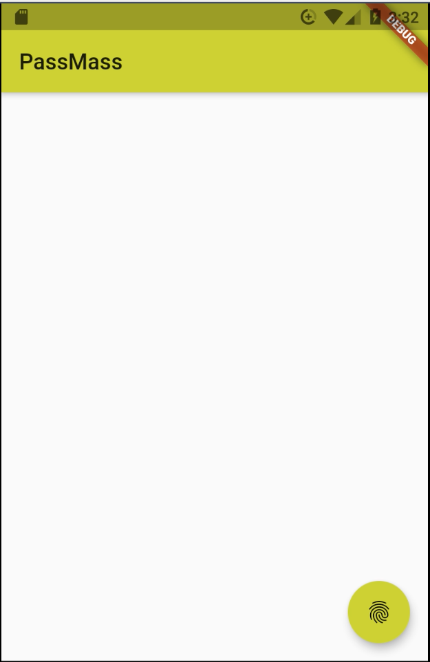
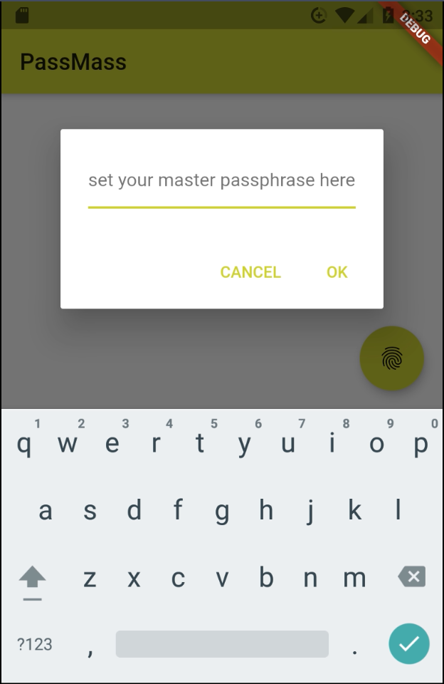
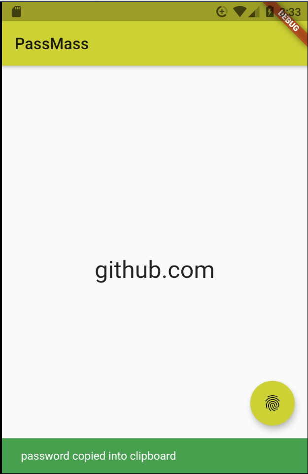

# passmass 

# 

a storage less password manager extension for chrome, firefox, android and ios

for this project i used a free icon from [flaticon.com](https://www.flaticon.com/free-icon/tickets_2959814?term=pass&page=1&position=9)

## screenshots

## How to use

### chrome:

#### solution one:

	1) clone this repo

	2) open chrome extensions

	3) enable developer mode

	4) click on load unpacked

	5) located the clone repo folder and done

#### solution two:

	1) clone this repo

	2) inside the repo locate 'chrome' folder

	4) open chrome extensions

	3) drag the passmass.crx file into chrome extensions and done

### firefox:

download it from official firefox addons website [passmass](https://addons.mozilla.org/en-US/firefox/addon/passmass/)

### android/ios: 

get it from [here](https://github.com/sepisoad/passmass-flutter) 
